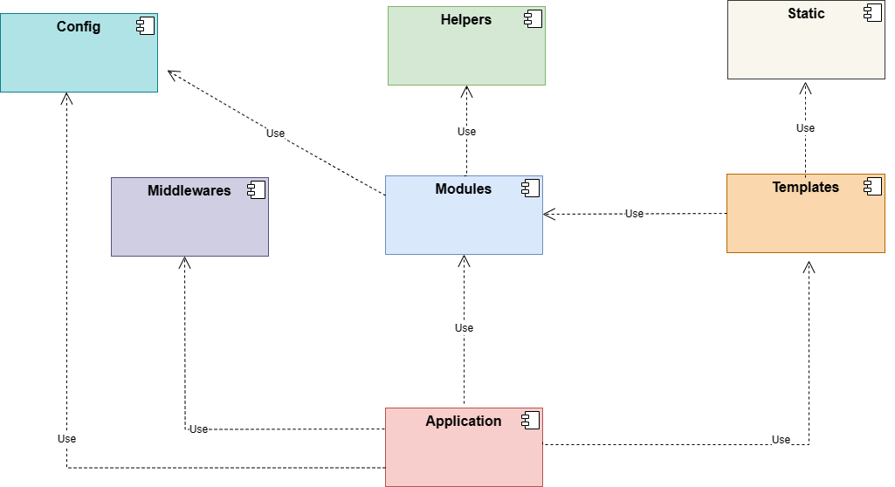
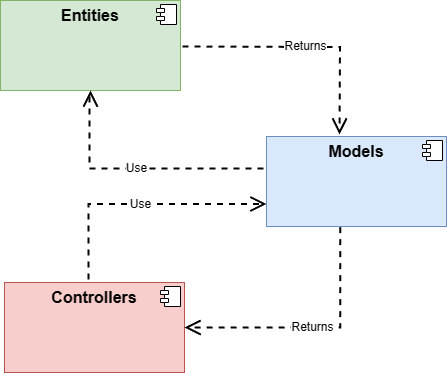
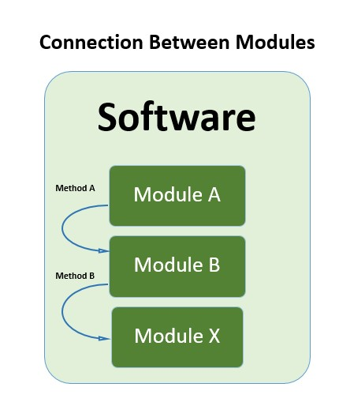
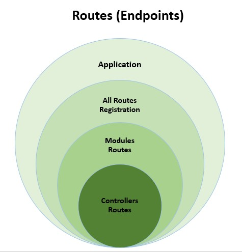
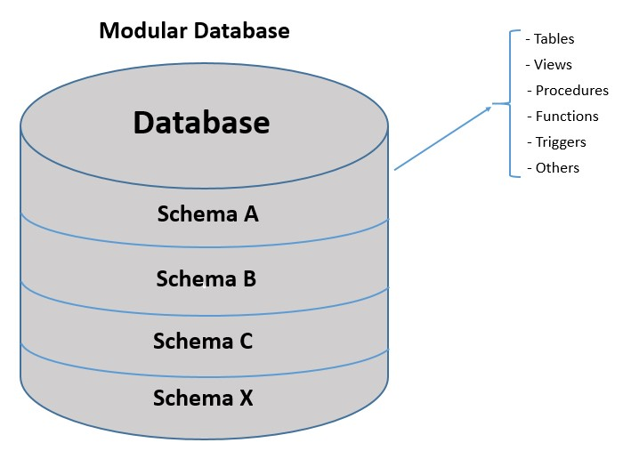
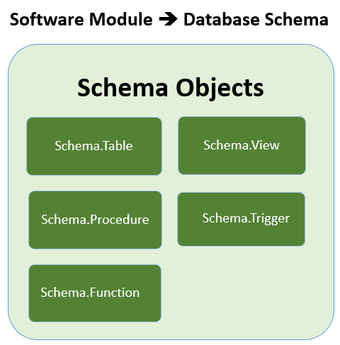

# Golang Modular Software Example
Example of a complete modular sofware, written in Golang 

## Status
- In progress

## Tools
- Golang
- Fiber Framework
- PostgreSQL

## Modules
- [x] Configurations 
- [x] Authentication
- [ ] Human Resources
- [ ] Customers

## Architecture

## Module Structure

## Module Comunication

## Routing 

## Database 

## How to Run App
- Configure Database:
    - Open Postgres: ``psql -U postgres``
    - Create Database: ``CREATE DATABASE golang_modular_software;``
    - Go to project and execute database scripts: ``go run exec_database_scripts.go``
    - Or Copy all database scripts located in [Datatabase folder](database)  to     Posgresql 
- Run Application: ``go run main.go``
- User the url: http://localhost:9000
- Login with Default user:
    - Username: admin@user.com
    - Password: 12345678