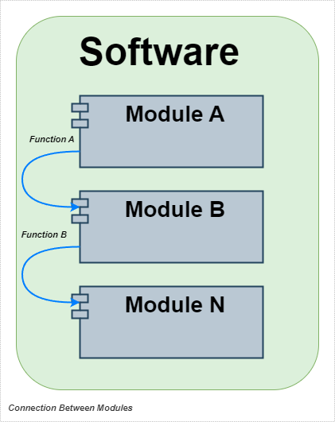
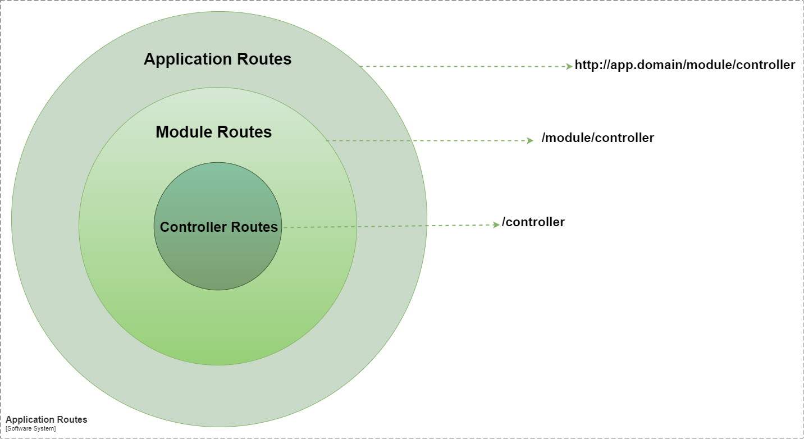

# Golang Modular Software Example
Example of a complete modular sofware, written in Golang 

## Status
- In progress

## Tools
- Golang
- Fiber Framework
- PostgreSQL

## Modules
- [x] Configurations 
- [x] Authentication
- [x] Company
- [x] Reference
- [x] Employees
- [ ] Reports

## Architecture

## Dependencies Between Modules

## Module Structure

## Module Flow

## Module Communication

## Routing 

## Database 

## Schema Objects 

## Module Creation

## App Initialization

## How to Run App
- Configure Database:
    - Open Postgres: ``psql -U postgres``
    - Create Database: ``CREATE DATABASE golang_modular_software;``
    - Add database to .env file -> var: DATABASE_MAIN_URL
- Run Application: ``go run main.go``
- User the url: http://localhost:4003
- Login with Default user:
    - Username: admin01
    - Password: 12345678